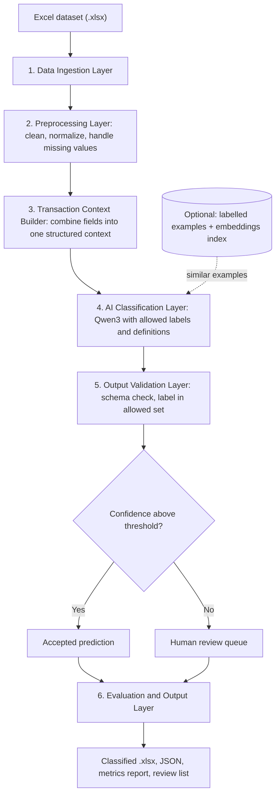

# VYOM+ : Intelligent Voucher Classification Using Open-Source LLMs

> **Problem Statement 4 · Hacktober Fest** — *Infer the missing accounting voucher type of a transaction by understanding the transaction as a whole, not by matching keywords.*

**Team:** `HackOps` · Baisakhi Parida · Ahana Iyer · Mrunmayee Deshpande· Harshwardhan
 Chhangani
---

## Executive Summary

Businesses record thousands of transactions, but a transaction row alone does not say *what kind of accounting voucher it is*: a Purchase, a Sales entry, a Payment, a Return, a Contra, a Stock Journal, and so on. Many of these share almost identical fields (party, invoice number, items, GST, amount), so keyword rules break down quickly.

**VYOM+** treats this as a **context-understanding problem**. It reads each structured transaction from the provided Excel file, builds a complete context (who is involved, which direction money and goods flow, whether stock moves, whether cash actually changes hands, what tax is applied), and hands that context to a **locally run open-source LLM (Qwen3)**. The model chooses **one voucher type from the fixed list defined by the challenge**. The output is constrained and validated, and it comes with a **confidence score and a short explanation**. Uncertain cases are routed to a human reviewer instead of being guessed.

---

## Table of Contents

1. [The Problem](#1-the-problem)
2. [Our Proposed Solution](#2-our-proposed-solution)
3. [Target Users](#3-target-users)
4. [Open-Source AI Technology](#4-open-source-ai-technology)
5. [AI's Role in the System](#5-ais-role-in-the-system)
6. [System Architecture](#6-system-architecture)
7. [Data Flow (with worked examples)](#7-data-flow-with-worked-examples)
8. [Handling Ambiguity](#8-handling-ambiguity)
9. [Tech Stack](#9-tech-stack)
10. [Implementation Plan](#10-implementation-plan)
11. [Expected Output](#11-expected-output)
12. [Project Scope: Core Commitments vs Stretch Goals](#12-project-scope-core-commitments-vs-stretch-goals)
13. [Scalability](#13-scalability)
14. [Dependencies](#14-dependencies)
15. [Expected Challenges and How We Handle Them](#15-expected-challenges-and-how-we-handle-them)
16. [Team and Contributions](#16-team-and-contributions)

---

## 1. The Problem

### 1.1 What is a voucher?

In accounting (and in ERP software such as Tally), a **voucher** is the formal record that documents a business transaction. Every transaction must be filed under a *voucher type*, because the type decides **which accounts are debited and credited, how GST is treated, and whether inventory is affected.**

Pick the wrong voucher type and the books are wrong: payables become receivables, stock levels drift, and tax filings go out of sync.

### 1.2 The challenge

A transaction record can contain plenty of information and still leave one question unanswered:

> **What kind of voucher does this transaction represent?**

For example, a row may contain a supplier name, an invoice number, item details, quantity, taxable value, and GST. It looks straightforward, but the system still has to decide whether it is a **Purchase**, a **Purchase Return**, an **Expense**, or an **inventory-related** entry.

The organizers provide an **Excel file in which the transaction data is already structured (this is not an OCR or invoice-extraction challenge) but the voucher type is intentionally missing.** Our task is to **infer the missing voucher type** for every transaction by looking at the whole record.

| | |
|---|---|
| **Input** | An `.xlsx` file where each row is a transaction/document with structured fields: seller/supplier, buyer/customer, invoice number and date, item descriptions, quantities, taxable value, GST, discounts, freight, payment information, currency, import/export details, payroll information, debit/credit information, return information, order references, delivery information, and other metadata |
| **Output** | Exactly **one voucher category per transaction**, in a structure that can be evaluated programmatically (for example `{ "invoice_number": "INV-2026-1042", "voucher_type": "Purchase" }`) |
| **Constraint** | An open-source or openly available LLM/SLM must be the primary classification intelligence; a proprietary API is not used |
| **Evaluation** | Possibly a hidden dataset with known labels, judged on accuracy, precision, recall, F1, per-category performance, handling of ambiguous records, output consistency, and speed |

### 1.3 The 27 target voucher categories

| Group | Voucher type | What it means in plain words | Typical signals |
|---|---|---|---|
| **Trading** | **Purchase** | We bought goods/services from a supplier on an invoice | Supplier is the counterparty, invoice, input GST, payable created |
| | **Sales** | We sold goods/services to a customer on an invoice | Customer is the counterparty, invoice, output GST, receivable created |
| | **Purchase Return / Debit Note** | Goods sent back to a supplier, or the supplier's bill is reduced | Supplier, reference to an earlier purchase, reversed quantity/amount |
| | **Sales Return / Credit Note** | A customer returned goods, or their bill is reduced | Customer, reference to an earlier sale, reversed quantity/amount |
| **Money movement** | **Payment** | Money **going out** of the business | Bank/cash outflow, no goods invoice |
| | **Receipt** | Money **coming in** to the business | Bank/cash inflow, settles a receivable |
| | **Contra** | Money moved **between our own** cash and bank accounts | Cash deposit/withdrawal, bank-to-bank transfer, no external party |
| | **Advance / Prepayment** | Money paid or received before goods/services are delivered | Payment with no matching invoice yet |
| | **Expense** | Day-to-day operating costs (rent, utilities, fees) | Service-type item, no stock movement |
| **Adjustments** | **Journal** | Non-cash adjustments and corrections | Provisions, depreciation, write-offs; no cash or stock movement |
| **People** | **Salary / Payroll** | Employee salary and related payouts | Employee as party, salary heads, deductions |
| | **Attendance** | Employee attendance records that feed payroll | Employee, dates/days present, no money value |
| **Orders** | **Purchase Order** | A *commitment* to buy; not yet a transaction | Order number, delivery date, no invoice, no payment, no stock yet |
| | **Sales Order** | A *commitment* to sell | Same idea on the selling side |
| | **Job Work In Order** | Order to process materials belonging to another party | Principal party, processing details |
| | **Job Work Out Order** | Order placed with an outside processor for our materials | Job worker as party, processing details |
| **Goods movement** | **Receipt Note** | Goods physically received, possibly before the invoice | Quantity, receipt details, often an order reference, no invoice value |
| | **Delivery Note** | Goods physically dispatched, possibly before the invoice | Quantity, dispatch details, often an order reference, no invoice value |
| | **Rejection In** | Rejected goods coming back to us (for example from a customer) | Return of goods due to quality or rejection, inbound stock |
| | **Rejection Out** | Rejected goods sent back (for example to a supplier) | Rejection reason, outbound stock |
| | **Material In** | Materials received from a party outside a normal purchase (typically job work) | Inbound materials, no purchase invoice |
| | **Material Out** | Materials sent out outside a normal sale (typically job work) | Outbound materials, no sales invoice |
| **Stock records** | **Stock Journal** | Internal stock transfer or conversion | Movement between locations or items, no external party |
| | **Physical Stock** | A stock count that corrects recorded quantities | Counted vs recorded quantity |
| **Cross-border** | **Import** | Purchase from a foreign party | Foreign supplier/currency, customs duty, IGST |
| | **Export** | Sale to a foreign party | Foreign customer/currency, shipping documents |
| **Fallback** | **Other / Miscellaneous** | Anything that fits none of the above | Unusual or mixed signals |

> The model is **only allowed** to answer with one of these categories. The definitions above are used to guide the model and are refined against the organizers' data.

### 1.4 Why this is hard: the confusable groups

These categories share many of the same fields, so the *meaning* of a record depends on how its fields relate to each other.

| Easily confused | What actually separates them |
|---|---|
| **Purchase vs Sales** | Direction: are we the buyer or the seller? Which side is the counterparty? Is the GST input or output? |
| **Purchase Return vs Sales Return** | Same as above, plus a reversal of an earlier transaction |
| **Payment vs Receipt** | Direction of money: out of or into the business |
| **Contra vs Payment / Receipt** | Both sides of the entry are our own cash/bank accounts; no external party |
| **Salary / Payroll vs other transactions** | Employee as party, salary components and deductions instead of goods or invoices |
| **Journal vs conventional Purchase / Sales** | Journal entries are adjustments with no real goods or cash movement |
| **Purchase / Sales Order vs Purchase / Sales** | An order is only a commitment: no invoice, no payment, no stock movement yet |
| **Receipt / Delivery Note, Material In/Out, Rejection In/Out, Stock Journal vs Purchase / Sales** | Goods move physically, but there may be no invoice or value, or the movement is internal |
| **Job Work orders vs ordinary orders** | The materials belong to (or are sent to) a processor rather than being traded |
| **Import / Export vs regular transactions** | Foreign party or currency, customs duty, IGST, shipping documents |

### 1.5 Why simple approaches fail

A rule such as *"GST + item = Purchase"* is wrong the moment the same record is a Sales invoice, a return, or an order. Keyword matching on words like "invoice" or "payment" ignores the **relationships between fields**, which is where the real signal lives. Reliable classification needs a system that **reads the record as a whole**.

---

## 2. Our Proposed Solution

We approach this as a **context-based classification problem, not a keyword-matching problem.**

> **More context → better understanding → better voucher classification.**

Instead of reacting to a single field, VYOM+ combines every useful signal in the record and asks the questions an accountant would ask:

- **Who is involved?** Supplier, customer, employee, bank, or ourselves?
- **What is the direction** of the transaction?
- **What kind of document is it?** Invoice, order, return, payment advice, stock note, or attendance sheet?
- **Is money actually being exchanged?**
- **Is inventory moving?**
- **Are there signs of import/export, job work, or payroll?**

### Our design principles

1. **AI is the decision-maker.** An open-source LLM reasons over the full context. Deterministic code only *prepares* the input and *validates* the output; it never overrides the model with hidden rules.
2. **Constrained, valid outputs only.** The model can answer *only* with a label from the allowed voucher set.
3. **Honest about uncertainty.** Every prediction carries a confidence score; low-confidence cases go to human review.
4. **Explainable.** Each prediction includes a short reason an accountant can check at a glance.
5. **Runs on modest hardware.** Model size is configurable so the system works on a laptop or a free cloud GPU.
6. **Focus on the hard boundaries.** Our effort goes into the confusable groups above, not just the obvious cases.

The goal is **not to replace the accountant**. It is to remove repetitive first-pass classification and make the process faster and more consistent. VYOM+ can also serve as the bridge between invoice extraction and automated voucher creation.

---

## 3. Target Users

| User | How VYOM+ helps |
|---|---|
| **Accountants and finance teams** | Get an initial voucher classification to review, instead of labelling each transaction by hand |
| **Businesses** (high volume of purchase, sales, payment, inventory transactions) | Cut repetitive data-entry work through automated classification |
| **Accounting / ERP software** | VYOM+ can act as a classification layer between structured transaction data and the accounting system, deciding which voucher workflow a record enters |
| **Bookkeeping and data-entry teams** | A first-pass label for large datasets, so people can concentrate on uncertain or exceptional cases |

---

## 4. Open-Source AI Technology

### Primary model: Qwen3 (Apache 2.0 licensed releases)

Our problem needs more than simple text classification. The model must interpret a structured transaction, connect information across fields, and separate categories that look very similar on the surface. We chose the **Qwen3** family because:

- **Flexible sizes** (from sub-1B up to dozens of billions of parameters) let us match the model to the available hardware and measure whether a bigger model is worth it.
- **Open weights**, with releases such as **Qwen3-4B** available under the **Apache 2.0 license**.
- **Strong reasoning and instruction-following** for a model that can run locally.
- **Switchable thinking / non-thinking mode**, so we can trade reasoning depth for speed.
- **Good ecosystem support** for quantization (GGUF), efficient serving, and LoRA/QLoRA fine-tuning.

### Model-selection strategy

| Role | Candidate | Why |
|---|---|---|
| **Fast baseline** | Qwen3-1.7B | Quick iteration, runs almost anywhere |
| **Primary candidate** | **Qwen3-4B** | Expected balance of accuracy and speed on a modest GPU or a quantized CPU run |
| **Accuracy check** | Qwen3-8B (hardware permitting) | Tests whether extra capacity helps on the hardest boundaries |
| **Alternatives (stretch)** | Gemma, Llama, Mistral, Phi (small variants) | Compared on the same evaluation set if time allows |

The final model is chosen on **accuracy, robustness, inference speed, and computational efficiency**, using evidence from our own evaluation.

### How the model is used

The model is **not** asked to generate a free-form answer. It receives:

```
Transaction Context  +  Allowed Voucher Categories (with definitions)   →   Predicted Voucher Type
```

We will also evaluate whether **few-shot examples, embeddings-based example retrieval, quantization, and LoRA/QLoRA fine-tuning** improve results enough to justify the added complexity.

---

## 5. AI's Role in the System

AI is the **primary intelligence layer**, not an optional add-on. It is the core component that understands transaction context and predicts the voucher type.

The model analyses structured fields such as:

- Seller / supplier and buyer / customer
- Invoice number and date
- Item descriptions, quantity, and taxable value
- GST, discounts, freight, and currency
- Payment information
- Debit / credit information
- Return information
- Import / export details
- Payroll information
- Order references and delivery information

It determines the **semantic relationship** between these fields (for example, "we are the buyer, GST is input tax, goods are received, payment is pending, so this is a Purchase") and classifies each transaction into the right category. For every prediction it also returns a **confidence score** and a **short explanation**.

What the AI does **not** do: it does not invent new voucher types or silently guess when the evidence is thin.

---

## 6. System Architecture



### Components

| # | Layer | Responsibility |
|---|---|---|
| 1 | **Data Ingestion** | Reads the provided `.xlsx` and extracts transaction records. No OCR or invoice-image processing is needed. |
| 2 | **Preprocessing** | Cleans and normalizes fields, handles missing values and inconsistent formats, prepares each record for the model. |
| 3 | **Transaction Context Builder** | Merges the relevant fields into one readable, structured representation so the model reasons over the *whole* transaction. It states which fields are present and which are absent, because absence is itself a signal (for example, no invoice value hints at an order or delivery note). It describes facts only; it does not make the decision. |
| 4 | **AI Classification Layer** | Qwen3 reads the context plus the allowed categories and their definitions (and, optionally, similar labelled examples) and predicts the voucher type with a confidence and a reason. |
| 5 | **Output Validation** | Verifies the response is valid structured JSON and that the label belongs to the permitted set. Invalid output is retried, then flagged. |
| 6 | **Evaluation and Output** | Compares predictions with known labels (when available) and produces the final files, metrics, and a review queue. |

---

## 7. Data Flow (with worked examples)

```
Excel Dataset
   → Read Transaction Row
   → Validate & Clean Fields
   → Normalize Transaction Data
   → Build Complete Transaction Context
   → Send Context to Open-Source LLM
   → AI Reasons Across Multiple Fields
   → Predict Voucher Category
   → Validate Prediction
   → Generate Structured JSON
   → Evaluation / User Output
```

### Example 1: a clear case

**Context sent to the model**

```
Invoice Number:  INV-2026-1042
Supplier:        ABC Traders
Items:           50 units of electronic components
Taxable Value:   ₹85,000
GST:             ₹15,300
Document:        Invoice
Payment Status:  Pending
```

**Allowed categories:** Purchase, Sales, Purchase Return / Debit Note, Sales Return / Credit Note, Payment, Receipt, Contra, Journal, ... *(the full 27-category list)*

**Model output (validated JSON)**

```json
{
  "invoice_number": "INV-2026-1042",
  "voucher_type": "Purchase",
  "confidence": 0.94,
  "reason": "Invoice from a supplier for goods with input GST and payment still pending, so a payable is created."
}
```

### Example 2: a hard boundary (illustrative)

A record shows a bank reference, an amount, and a party name, with **no items, no GST, and no invoice**. The deciding question is *direction*: if the money leaves our account to a supplier, the voucher is a **Payment**; if it arrives from a customer, it is a **Receipt**; if both sides are our own bank/cash accounts, it is a **Contra**. The model weighs these signals together instead of reacting to the word "payment".

---

## 8. Handling Ambiguity

When information is incomplete or several categories look similar, the system uses the **complete available context** before predicting, and it surfaces uncertainty rather than hiding it.

| Situation | How VYOM+ responds |
|---|---|
| Missing or blank fields | Normalized in preprocessing; the context states what is *absent* |
| Two close categories (Purchase vs Purchase Order) | The prompt asks the model to check the discriminating questions (invoice present? money moved? stock moved?) |
| Conflicting information | The model notes the conflict in its reason, and confidence drops |
| Low confidence | Prediction is **flagged for human review** instead of being silently accepted |
| Invalid or off-list answer | Blocked by constrained decoding and the validation layer; retried, then flagged |

The design specifically targets **Purchase vs Sales, Purchase Return vs Sales Return, Payment vs Receipt, Contra, Salary/Payroll, Journal, inventory-movement vouchers, and Import/Export**, which are the distinctions the challenge highlights.

---

## 9. Tech Stack

*Status: **Core** = we commit to building it. **Stretch** = we will attempt it if time, data, and hardware allow.*

| Layer | Technology | Purpose | Status |
|---|---|---|---|
| **Language** | Python 3.10+ | Core implementation | Core |
| **Data handling** | `pandas`, `openpyxl` | Read and write the Excel dataset, clean and transform records | Core |
| **Schema and validation** | `pydantic` | Strict structure for transaction records and model output | Core |
| **LLM** | **Qwen3** (1.7B and **4B**) | Context-based voucher classification | Core |
| **Local runtime** | `Ollama` or `llama.cpp` with quantized **GGUF** weights | Local inference on CPU or modest GPU | Core |
| **Constrained output** | JSON-schema / grammar-constrained decoding (Ollama structured outputs, `llama.cpp` grammars, or `outlines`) | Guarantees the answer is a valid label from the allowed set | Core |
| **Confidence scoring** | Token log-probabilities where the runtime supports them; otherwise agreement across repeated runs | Turns model output into a confidence value for review routing | Core |
| **Evaluation** | `scikit-learn`, `matplotlib` | Accuracy, precision, recall, F1, per-class report, confusion matrix | Core |
| **Interface** | Command-line tool (Excel in, classified Excel and JSON out) | Run the full pipeline reproducibly | Core |
| **Larger model check** | Qwen3-8B via the same runtime | Test whether more capacity helps | Stretch |
| **GPU batch runtime** | Hugging Face `transformers` (optionally `vLLM`) | Faster batch processing on a GPU | Stretch |
| **Few-shot retrieval** | `sentence-transformers` + `FAISS` | Retrieve similar labelled transactions as in-context examples | Stretch (needs labelled examples) |
| **Fine-tuning** | `peft`, `trl`, `bitsandbytes` (LoRA / QLoRA) | Adapt the model to the voucher domain | Stretch (needs labelled data and a GPU) |
| **Demo interface** | `Streamlit` | Upload an Excel file, view predictions and the review queue | Stretch |
| **Other model families** | Gemma, Llama, Mistral, Phi (small variants) | Benchmark against Qwen3 | Stretch |
| **Compute** | Local machine; free GPU tiers on Google Colab / Kaggle for experiments | Keeps the project affordable | Core |

---

## 10. Implementation Plan

*The qualifier round is proposal-only. This is the plan we will execute in the final round.*

| Phase | Goal | Key activities | Done when |
|---|---|---|---|
| **0. Data understanding** | Know exactly what we are classifying | Explore the Excel columns; map each field to a role (party, document, item, tax, payment, inventory, import/export, payroll); note missing-value patterns; freeze the 27-category label set | Field map and label set are frozen |
| **1. Pipeline foundation** | Reliable input to the model | Build ingestion, cleaning, normalization, and the Transaction Context Builder; define the schemas | Any row converts into a clean, consistent context |
| **2. Zero-shot baseline** | A first working classifier | Run Qwen3 with a prompt containing category definitions and constrained JSON output; record baseline results | End-to-end predictions on the full dataset, valid labels only |
| **3. Prompt refinement** | Improve the hard boundaries | Add discriminating questions per confusable group; add a few hand-written examples; study errors on the hard pairs | Measurable gain on the hard pairs over the baseline |
| **4. Model comparison** | Choose the model on evidence | Compare Qwen3 sizes and quantization levels; measure accuracy against speed | A justified final model and configuration |
| **5. Confidence and review** | Make it trustworthy | Calibrate confidence thresholds; generate short reasons; build the human-review queue | Low-confidence cases are routed to review with explanations |
| **6. Evaluation and packaging** | Make it reproducible | Evaluation script with a clear, repeatable method on unseen records; clear run instructions; short demo | One command takes an Excel file in and produces a classified file and a metrics report |
| **7. Stretch work** | Push accuracy further | Retrieval-based few-shot examples, LoRA/QLoRA, other model families, Streamlit demo | Adopted only if the gain clearly outweighs the added complexity |

**Evaluation method:** because the organizers intentionally withhold voucher types, we will build a small **hand-labelled validation sample** that covers every category (especially the confusable groups), measure results on records the prompts were *not* tuned on, and report per-category results so weak categories are visible rather than hidden.

---

## 11. Expected Output

### 11.1 Deliverables

| Output | Description |
|---|---|
| **Structured JSON** | One validated object per transaction, at minimum `invoice_number` and `voucher_type`, optionally with `confidence` and `reason` |
| **Classified Excel file** | The original dataset with added columns: `predicted_voucher_type`, `confidence`, `explanation`, `needs_review` |
| **Review queue** | A separate list of low-confidence or conflicting transactions for human verification |
| **Evaluation report** | Accuracy, precision, recall, F1 (overall and per category), confusion matrix, and inference-speed figures |
| **Reproducible code and run instructions** | Delivered in the final round |

### 11.2 Sample output

| Invoice No. | Predicted voucher type | Confidence | Explanation | Needs review |
|---|---|---|---|---|
| INV-2026-1042 | Purchase | 0.94 | Supplier invoice for goods with input GST; payment pending | No |
| RCT-2026-0310 | Receipt | 0.91 | Money received from a customer against an earlier invoice; no goods invoice | No |
| TRF-2026-0077 | Contra | 0.88 | Both accounts are the company's own bank and cash accounts | No |
| CN-2026-0015 | Sales Return / Credit Note | 0.62 | Reversal of goods to a customer, but the original invoice reference is missing | **Yes** |

*(Illustrative values only. Real results will come from the organizers' dataset.)*

### 11.3 How we will measure success

- **Accuracy and macro-F1** across all voucher types
- **Per-category precision and recall**, with special attention to the confusable groups
- **Valid-output rate** (every prediction must be inside the allowed label set)
- **Behaviour on ambiguous or incomplete records**
- **Output consistency** (the same record gives the same answer across runs)
- **Inference speed and computational efficiency**
- **Review-routing quality**: how well low confidence lines up with real errors

---

## 12. Project Scope: Core Commitments vs Stretch Goals

We would rather promise less and deliver it than promise everything.

**What we commit to delivering in the final round**
- A working pipeline: Excel in, one valid voucher type per transaction out, using a locally run open-source Qwen3 model as the classifier.
- Output restricted to the official voucher categories, in machine-readable form.
- Confidence scores, short explanations, and a human-review flag.
- A reproducible evaluation method with per-category results.
- Honest reporting of where the system is weak.

**What we will attempt but do not guarantee**
- Retrieval-based few-shot examples and LoRA/QLoRA fine-tuning. These depend on having enough labelled data and GPU access, and they are adopted only if they clearly help.
- Larger models and other model families, depending on available hardware.
- A Streamlit demo interface.

**What we do not promise**
- A specific accuracy figure. Performance on rare or highly similar categories depends on the real dataset, which we will only see in the final round.

---

## 13. Scalability

VYOM+ is designed to grow from classifying a single transaction to supporting high-volume accounting workflows.

- **Large-scale processing:** records are processed in batches, so large datasets can be classified with minimal manual intervention.
- **Flexible model deployment:** different Qwen3 sizes can be selected based on available compute and the accuracy required.
- **ERP and accounting integration:** VYOM+ can sit as an AI classification layer between structured transaction data and accounting/ERP workflows.
- **Human-in-the-loop:** high-confidence transactions are classified automatically, while uncertain or exceptional ones are flagged for review.
- **Model optimization:** quantization, embeddings, and LoRA/QLoRA can be explored to improve inference efficiency and model performance.

---

## 14. Dependencies

| Dependency | Why it is needed |
|---|---|
| **Structured transaction dataset** (Excel) | Contains parties, documents, items, quantities, amounts, taxes, payment information, and inventory details |
| **Qwen3 open-source LLM** | Primary AI layer for context-based voucher classification |
| **Computational resources** | Local CPU/GPU sufficient for inference, depending on the chosen Qwen3 variant |
| **Preprocessing pipeline** | Cleans, structures, and combines fields into meaningful context |
| **Defined voucher categories** | The model is constrained to the categories provided by the challenge |
| **Validation sample and evaluation** | Needed to measure accuracy and refine prompts, preprocessing, and model configuration |

---

## 15. Expected Challenges and How We Handle Them

| # | Challenge | Why it matters | Our mitigation |
|---|---|---|---|
| 1 | **Ambiguous voucher categories** | Purchase vs Sales, return types, and Payment vs Receipt carry similar information | Category definitions and discriminating questions in the prompt; targeted examples for each confusable group |
| 2 | **Contextual understanding** | Direction, document type, payment status, inventory movement, and tax must be read *jointly*, not as keywords | Context Builder merges all fields into one representation; the model reasons over the whole record |
| 3 | **Edge cases and accuracy** | Real data can be incomplete, unusual, or contradictory | Explicit handling of missing fields; low confidence triggers human review; error analysis focused on edge cases |
| 4 | **Constrained model output** | Downstream processing needs a valid voucher category every time | Grammar / JSON-schema constrained decoding plus a validation layer, with retry and flagging |
| 5 | **Hardware vs performance trade-off** | Larger models understand better but need more compute | Benchmark several sizes and quantization levels; choose the best accuracy-per-resource option |
| 6 | **Dataset quality and coverage** | Rare voucher types and hard boundaries may be under-represented | Robust preprocessing; hand-labelled validation sample; optional retrieval of examples and fine-tuning for weak classes |
| 7 | **Explainability and human trust** | Voucher classification influences accounting workflows | Short explanation and confidence per prediction; review queue for uncertain cases |
| 8 | **Many fine-grained categories** | 27 categories, several rare and very similar (for example Material In vs Receipt Note) | Clear per-category definitions in the prompt; per-category evaluation to expose weak spots early |

---

## 16. Team and Contributions

| Member | Contribution |
|---|---|
| **Baisakhi** | Problem, proposed solutions, target users, open-source AI technology |
| **Ahana** | Scalability, dependencies, expected challenges |
| **Mrunmayee** | AI's role, architecture, data flow |
| **Harshwardhan** | Tech stack, implementation plan, expected output |

---

<p align="center"><b>VYOM+</b> — the right voucher, for the right reason, every time.</p>
